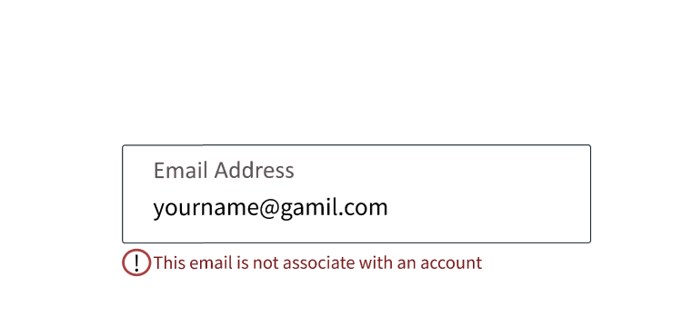

# signal-address-figma

When a user enters an incorrect or unregistered email address, they see this screen:

[View in Figma](https://www.figma.com/design/0MPzivObRQhXLQ899BBRYI/Figma-First-Project?node-id=133-65&t=1yTrYhRim3YK4kBi-1)
